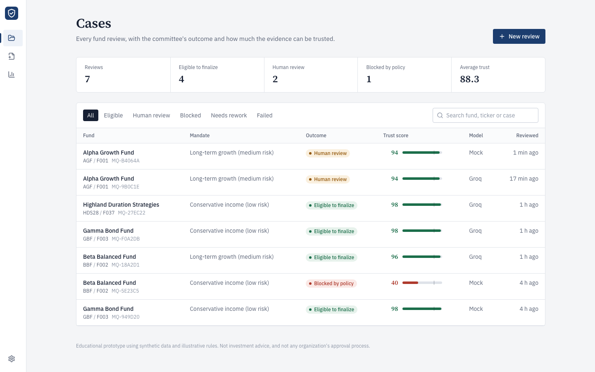
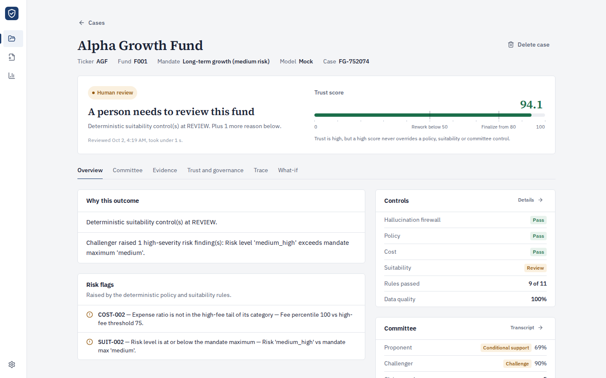
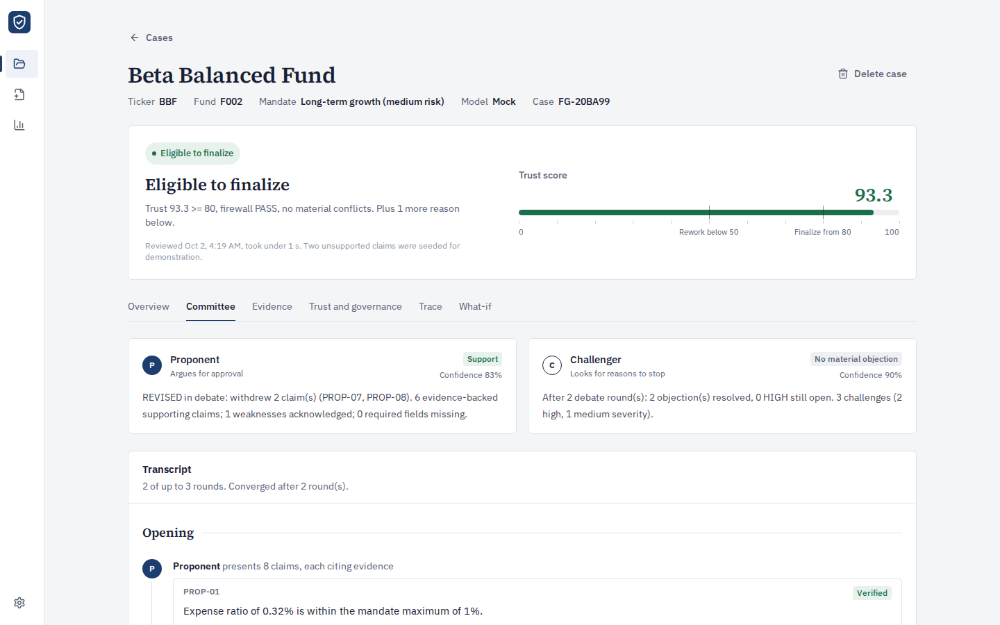
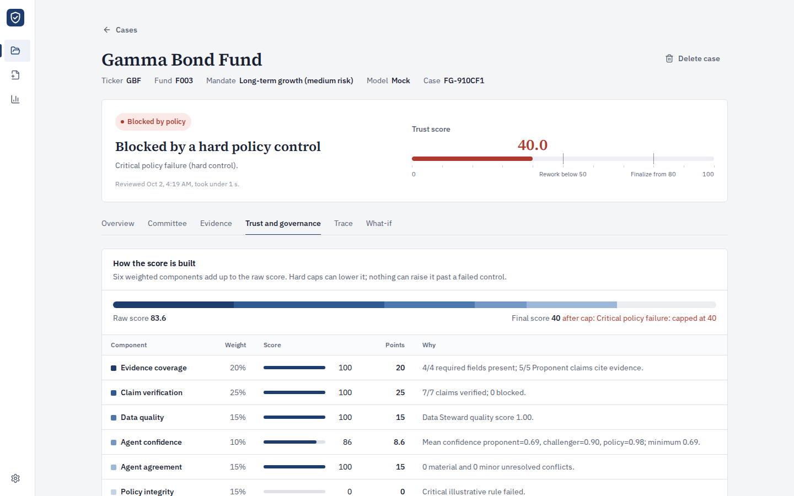
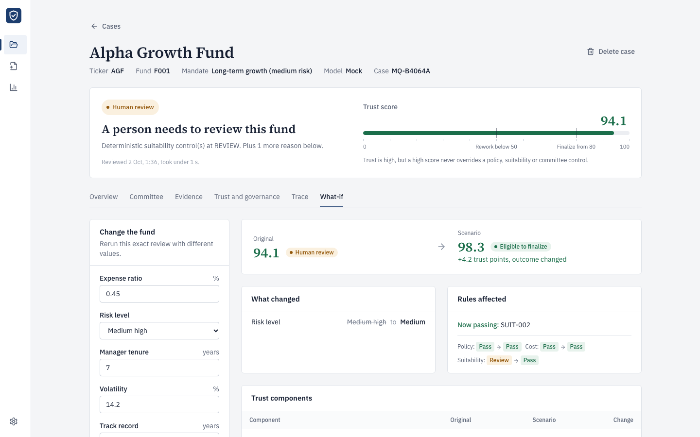
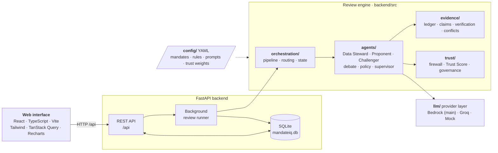
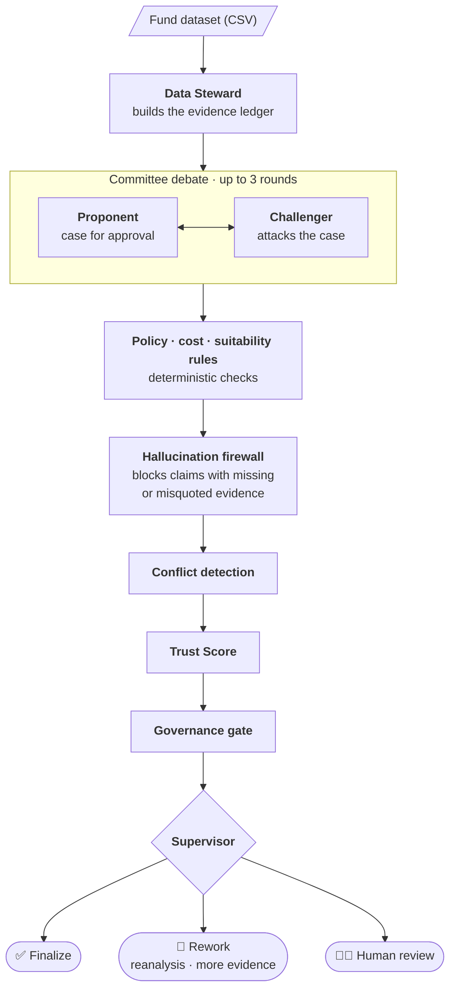

# MandateIQ

**Evidence-first adversarial review of fund nominations.**

MandateIQ reviews one fund at a time against an investment mandate. A
_Proponent_ agent builds the case for approval, a _Challenger_ agent attacks
it, and the two debate for up to three rounds. Every claim must cite the
evidence ledger; a hallucination firewall blocks claims that cite missing or
misquoted evidence. Deterministic policy, cost and suitability rules run
alongside the agents, and an auditable **Trust Score** decides whether the
case can be finalized, needs rework, or goes to a person.

A high Trust Score can never override a failed policy, suitability or
committee control.

> **Educational prototype.** MandateIQ uses synthetic data and illustrative
> rules. It is not investment advice and does not represent any
> organization's approval process.



## What you can do

| Screen                          | Purpose                                                                                                                               |
| ------------------------------- | ------------------------------------------------------------------------------------------------------------------------------------- |
| **Cases**                       | Every review with its outcome and Trust Score; filter and search.                                                                     |
| **New review**                  | Four steps: dataset (demo or your CSV), fund and mandate, model, confirm. Progress streams live while agents work.                    |
| **Case → Overview**             | The verdict, why it was reached, and what a human reviewer must decide.                                                               |
| **Case → Committee**            | The Proponent/Challenger debate as a round-by-round transcript. Withdrawn claims are struck through; evidence IDs link to the ledger. |
| **Case → Evidence**             | The Data Steward's evidence ledger, data quality and transformations.                                                                 |
| **Case → Trust and governance** | How the Trust Score was built, caps applied, firewall results, every rule, and agent conflicts.                                       |
| **Case → Trace**                | Pipeline timing, routing decisions, model/latency per agent, and every tool call.                                                     |
| **Case → What-if**              | Change expense ratio, risk level, tenure, volatility or track record and rerun the full pipeline; see the before/after comparison.    |
| **Insights**                    | Outcomes, trust distribution, weakest trust components and frequent risk flags across all reviews.                                    |

|                                                      |                                                         |
| ---------------------------------------------------- | ------------------------------------------------------- |
|  |  |
|   |                 |

## Architecture



| Folder | Contents |
| --- | --- |
| `frontend/` | React + TypeScript web interface |
| `backend/api/` | FastAPI app, SQLite storage, background review runner |
| `backend/src/agents/` | Data Steward, Proponent, Challenger, debate, policy, supervisor |
| `backend/src/llm/` | Provider layer: Bedrock (main), Groq, mock |
| `backend/src/evidence/` | Evidence ledger, claims, verification, conflicts |
| `backend/src/trust/` | Hallucination firewall, Trust Score, governance gate |
| `backend/src/orchestration/` | Pipeline, routing, shared workflow state |
| `backend/config/` | Mandates, rules, prompts, trust weights (YAML) |
| `backend/tests/` | Unit, integration and API tests (no keys needed) |

### Review pipeline



Reviews run one at a time on a background worker and are stored in
`backend/data/mandateiq.db` (SQLite), so cases survive restarts.

## Model providers

| Provider                  | When to use                | Configure in `.env`                                                   |
| ------------------------- | -------------------------- | --------------------------------------------------------------------- |
| **Amazon Bedrock** (main) | Production runs            | `BEDROCK_MODEL_ID`, `AWS_REGION`, AWS credentials                     |
| **Groq**                  | Running without AWS access | `GROQ_API_KEY`, optional `GROQ_MODEL` (default `openai/gpt-oss-120b`) |
| **Mock**                  | Offline demos and tests    | Nothing; deterministic, no model calls                                |

The tool-using agents were written against the Bedrock Converse API. Groq
runs the same agent loop through an adapter (`backend/src/llm/groq_client.py`)
that translates tool definitions, tool calls and results to Groq's
OpenAI-compatible format, so agent logic is identical on both providers.
Rate-limit errors are retried with backoff.

Choose the provider per review in the web interface; `LLM_PROVIDER` sets the
default.

## Getting started

Requirements: Python 3.10+, Node.js 18+.

### Quick start (one command)

```bash
./run.sh
```

This creates `.env` from `.env.example` if needed, installs dependencies,
builds the web interface, and serves everything at
<http://localhost:8000>. Add `GROQ_API_KEY` (or Bedrock settings) to `.env`
and restart to use a real model.

### Development (two terminals)

```bash
cp .env.example .env            # then edit

# Terminal 1: API on :8000
cd backend
python3 -m venv .venv && source .venv/bin/activate
pip install -r requirements-dev.txt
uvicorn api.main:app --reload --port 8000

# Terminal 2: web interface on :5173 (forwards /api to :8000)
cd frontend
npm install
npm run dev
```

Open <http://localhost:5173>. API docs are at <http://localhost:8000/docs>.

### Tests

```bash
cd backend
pytest
```

All tests run in mock mode with scripted models, including the full
committee on both the Bedrock and Groq code paths. The real-Bedrock smoke
tests run only with `RUN_BEDROCK=1` and a configured `BEDROCK_MODEL_ID`.

### Command-line demos

```bash
cd backend
LLM_PROVIDER=mock python3 scripts/demo_committee.py        # six scripted cases
LLM_PROVIDER=mock python3 scripts/live_mandateiq_pipeline.py
LLM_PROVIDER=groq python3 scripts/demo_committee.py B       # case B on Groq
```

## Dataset format

Upload a CSV with at least these columns:
`fund_id, fund_name, ticker, expense_ratio, asset_class, risk_level, history_years`.
Optional columns used by rules and agents include `category`,
`manager_tenure_years`, `return_5y` and `volatility`. See
`backend/data/sample/fund_sample.csv`.

Mandates, rules and Trust Score weights live in `backend/config/*.yaml`.

## Demonstrating the firewall

On the model step of **New review**, tick **Seed two unsupported claims**.
The Proponent receives one claim citing evidence that does not exist and one
that misquotes a value. The Committee tab then shows the Challenger catching
both, the Proponent conceding, and the claims being withdrawn.
